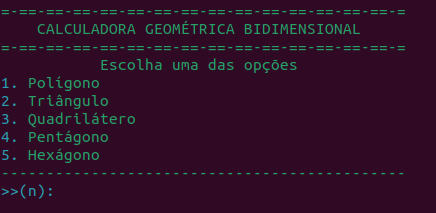
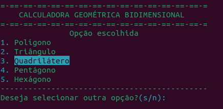
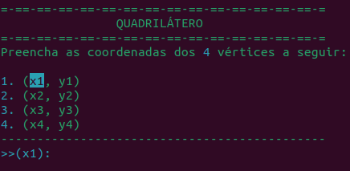
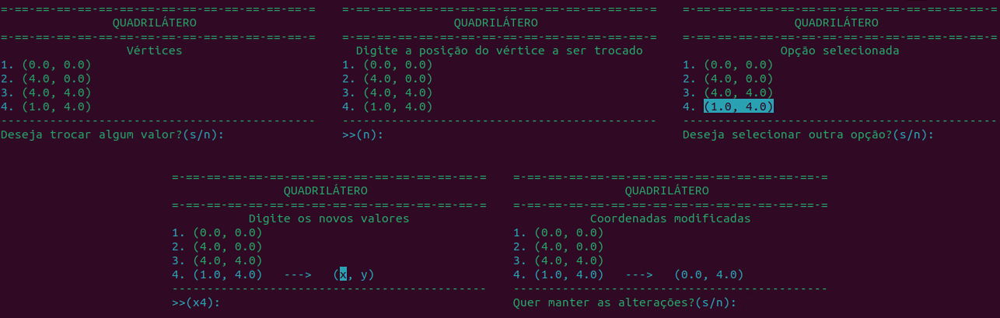
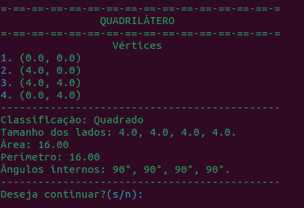

# Orientação a Objetos
Projeto administrado em torno do paradigma de programação orientado a objetos.

## Objetivos
Desenvolver habilidades práticas para a implementação de sistemas de software projetados em torno da abordagem OO a partir de:
* Estudo sobre os contrastes entre o paradigma procedural para desenvolvimento de softwares
* Modelagem de projetos baseados na linguagem-padrão UML
* Realização de miniprojetos durante exposição de conteúdos teóricos e práticos
* Realização de projeto final com potencial utilização na Web (CRUD)

## Possíveis linguagens, e frameworks, a serem utilizados
* [C++](https://isocpp.org/)
* [Python](https://www.python.org/)
* [Ruby](https://www.ruby-lang.org/en/)
* [Django](https://www.djangoproject.com/)
* [Rails](https://rubyonrails.org/)

## Projetos

### [Calculadora Geométrica Bidimensional](Projetos/calculadoraGeo)
#### Objetivo:
Projetar um pequeno universo interativo dentro do qual seja possível registrar formas geométricas bidimensionais
úteis para verificações e cálculos simples.
#### Programa:
***Arquivos***
* calcGeo.py: Arquivo responsável pela execução da calculadora
* figurasGeometricas.py: Arquivo com as classes das figuras geométricas
* utils.py: Arquivo com os utilitários usados para a configuração dos menus de seleção e organização de listas
* Planejamento.txt: Planejamento em pseudo-código das classes
* casosTeste.txt: Arquivo com entradas para teste e suas respectivas saídas esperadas

***Execução***

O programa apenas utiliza de biblitecas nativas do python3 sendo precisa apenas a instalacão desse, portanto para rodar o código
é necessário, estando dentro do diretório onde o aquivo calcGeo.py está localizado, executar o seguinte comando:
```
$ python3 calcGeo.py
```

Sua execução abre um menu com as figuras disponíveis para realização dos cálculos, podendo selecioná-las
a partir do número em azul a sua esquerda (1-5)



Recebendo o número, o programa realça a opção selecionada e solicita a confirmação do usuário para proceder (s/n)



Após a confirmação, é exibido um menu para o preenchimento das coordenadas, grifando a posição referente a entrada de dados


Com as coordenadas completas, é perguntado se o usuário deseja trocar algum vértice (s/n), sua escolha podendo levá-lo a
um menu de troca onde a seleção é a mesma do menu inicial, solicitando uma confirmação em cada etapa



Por fim é mostrado o resultado dos cálculos




